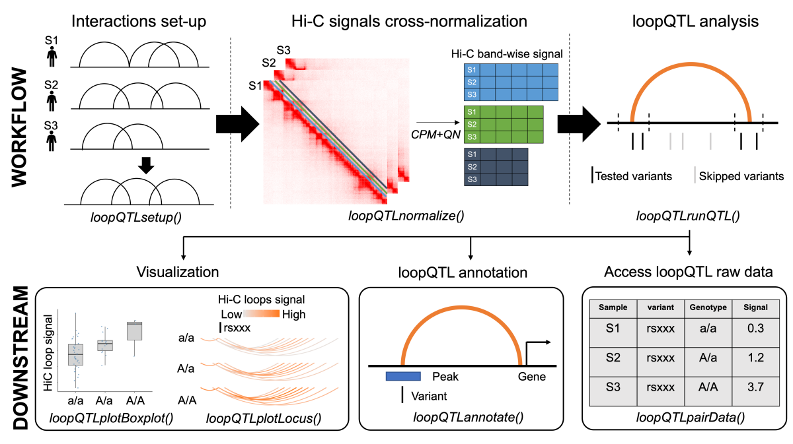

# loopQTL

An R package for mapping chromatin loop QTLs from Hi-C: **does a SNP at a loop's anchors associate with the loop's contact strength across samples?**

Unlike peak-centric window-scan tools (e.g. QTLtools), `loopQTL` only tests SNPs that fall inside a loop's **anchor bins** - because for a given loop, SNPs elsewhere in a wide cis-window are biologically unrelated to whether that loop forms. Intra-chromosomal loops only. No FDR or lead-SNP selection inside the package (returned as a full per-(loop, SNP) table so users can apply their own correction).

## Pipeline overview



```         
loopQTLsetup()      -> validate VCF + .hic headers, read loop BEDPEs, build the
                        exact-coordinate consensus loop set (loops kept when they
                        appear in >= minSamples samples). Optionally auto-computes
                        per-sample cis depth from .hic.
                        After running this step, the loopQTL S4 class object will be
                        set up along with the consensus loops set stored.

loopQTLnormalize()  -> per-chromosome whole-genome straw pull (parallel):
                        log-CPM depth correction + band-wise quantile
                        normalization across samples, adapted from Kipper et al, 2024.
                        After running this step, the normalized matrix will be saved
                        in obj@phenotype.

runQTL()            -> targeted tabix VCF read of anchor SNPs, then MatrixEQTL
                        once per anchor.
                        After running this step, the loopQTL results will be saved in obj@results.
```

A single `loopQTL` S4 object is threaded through all functions; sample order is an invariant so matrices always stay aligned.

## Install

Bioconductor + CRAN dependencies:

``` r
if (!requireNamespace("BiocManager", quietly = TRUE)) install.packages("BiocManager")
BiocManager::install(c(
  "strawr", "preprocessCore",
  "GenomicRanges", "IRanges", "InteractionSet",
  "S4Vectors", "VariantAnnotation", "Rsamtools",
  "SummarizedExperiment", "BiocParallel", "rtracklayer"
))
install.packages(c("MatrixEQTL", "data.table", "ggplot2", "scales"))
```

`PCAForQTL` (used for auto-selecting phenotype PCs as covariates) is GitHub-only:

``` r
remotes::install_github("heatherjzhou/PCAForQTL")
```

Then install `loopQTL`:

``` r
remotes::install_github("rhielab/loopQTL")
```

## Quick start

``` r
library(loopQTL)

samplesDF <- data.frame(
  Sample = c("S1", "S2", "S3"),
  hic    = c("S1.hic", "S2.hic", "S3.hic"),
  loops  = c("S1_loops.bedpe", "S2_loops.bedpe", "S3_loops.bedpe"),
  # optional: precomputed cis-contact totals; otherwise computed from .hic
  cis    = c(8.1e7, 7.4e7, 9.2e7),
  stringsAsFactors = FALSE
)

obj <- loopQTLsetup(
  samples     = samplesDF,
  vcf         = "cohort.vcf.gz",     # bgzipped + tabix-indexed
  resolution  = 10000,              # bp; must exist in every .hic
  minSamples = 2                   # consensus filter
)

obj <- loopQTLnormalize(
  obj,
  BPPARAM = BiocParallel::MulticoreParam(workers = 8)
)
## obj@phenotype now holds the pre-RINT normalized output (inspect for QC)

## By default runQTL() applies RINT per loop before regression (normal = TRUE)
## AND auto-picks K phenotype PCs via PCAForQTL as the regression covariates.
## You can also pass a fixed covariate matrix instead:
##   pcs <- loopQTLchooseK(obj, Kmethod = "BE")$PCs
##   obj <- runQTL(obj, window = 0, covariates = pcs)

obj <- runQTL(obj, window = 0, normal = TRUE)
head(obj@results)
##   loopID  snpID  chrom  pos  ref  alt  anchor  beta  se  t  p  nUsed  maf
```

## Annotate results with target genes and enhancer peaks

`loopQTLannotate()` adds three columns to `obj@results`:

- **`gene`** - comma-separated gene names whose TSS (± `TSSwindow`) sits in the SNP's *partner* anchor
- **`peak`** - logical: does the SNP overlap any peak from a user-supplied peak file (with optional TSS filtering)
- **`Type`** - one of `WithinTSS`, `rs-gene`, `rs-<peak_label>`, `rs-O`, `rs(<peak_label>)-gene`, `rs(<peak_label>)-<peak_label>`, `rs(<peak_label>)-O`

``` r
obj <- loopQTLannotate(
  obj,
  gtf             = "gencode.v43.gtf.gz",
  peak            = "H3K27ac_peaks.bed",   # optional
  peakAnnotation = "Enhancer"
)
head(obj@results[, c("snpID", "loopID", "anchor", "gene", "peak", "Type")])
```

## Save per-SNP contact submatrices for SNP-correlation maps

Pass `saveWindows = TRUE` to `loopQTLnormalize()` to also save a `.rds` containing a `samples × cells` matrix of post-band-QN contact values around each in-loop SNP. Values are sliced from the per-chrom matrix that fills the phenotype, so no recomputation. This is a diagnostic/visualization output - it does not affect `obj@phenotype` or `runQTL()`.

``` r
obj <- loopQTLnormalize(
  obj,
  saveWindows = TRUE,
  windowsOut  = "loop_snp_windows.rds",
  window       = 1000000,       # minimum window extent in bp
  snpWindow   = 0         # anchor flank for SNP selection
)

w <- readRDS("loop_snp_windows.rds")
## w$cells       : samples x N_cells numeric matrix (post-band-QN, pre-RINT)
## w$cellCoordinates : data.frame(chrom, binI, binJ) per column
## w$snpIndex   : data.frame(snpID, chrom, pos, ref, alt, binLo, binHi,
##                            n_loops_anchored, colIndices)  -- one row per SNP
```

## Plot a heatmap for a single SNP

`loopQTLplotSnpWindow()` renders a Hi-C-style beta heatmap around any single SNP, matching the visualization style of Shi et al. 2025 (*Genome Biology*):

``` r
p <- loopQTLplotSnpWindow(
  obj, snpID = "rs123456",
  chrom  = "chr16",
  start  = 72410000, end = 73470000,   # crop to a region of interest
  normal = TRUE, covariates = "auto"   # match runQTL()'s partial-beta test
)
ggplot2::ggsave("rs123456_snp_window.pdf", p, width = 8, height = 8)
```

GPLv3. See [LICENSE](LICENSE).
